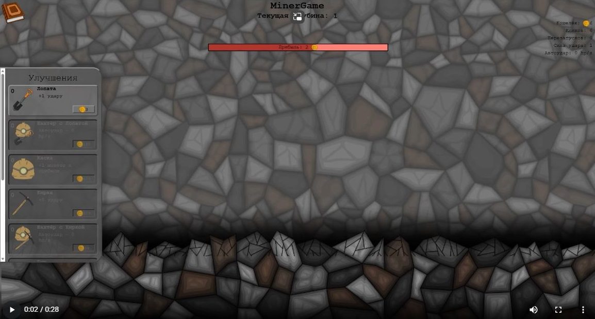
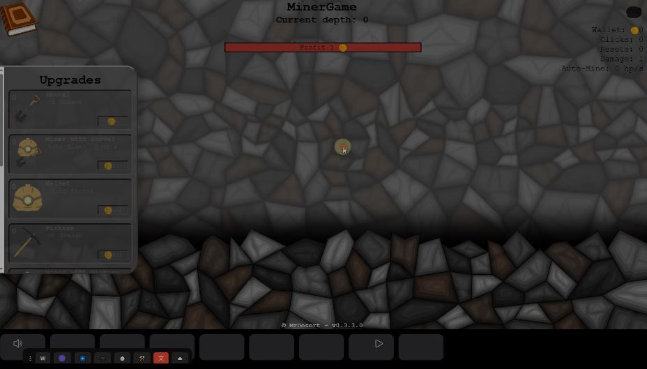
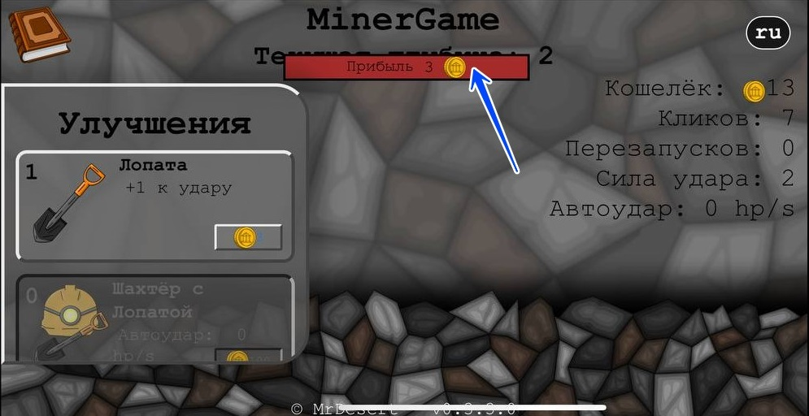
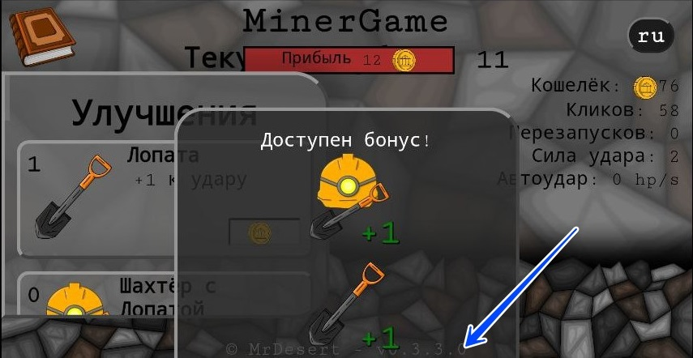
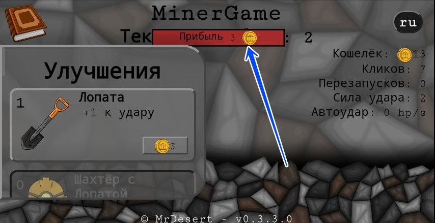
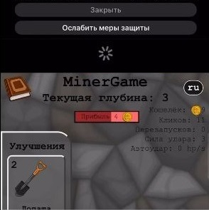
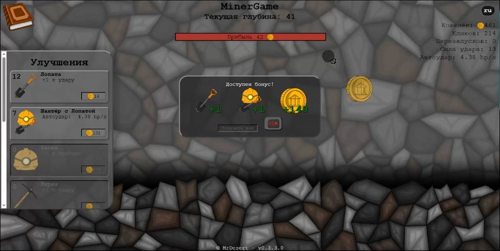
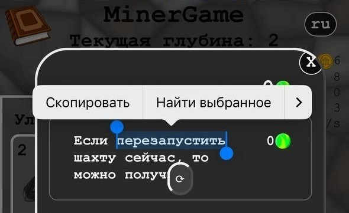

# Баг лист MinerGame

### Таблицы обозначений

|Статус           |🏷️  |Критичность|🏷️  |Приоритет|🏷️ |Сложность|🏷️   |
|:----------------|:---:|:---------|:---:|:--------|:--:|:--------|:---:|
|НА РАСМОТРЕНИИ   |🔎👀|ВЫСОКАЯ   |🔴⚠️|ВЫСОКИЙ  |🟥🔥|ВЫСОКАЯ  |🏋️🧠|
|ОТКЛОНЕНО        |❌🚫|СРЕДНЯЯ   |🟡📌|СРЕДНИЙ  |🟨🗓️|СРЕДНЯЯ  |🚶📈|
|ПРИОСТАНОВЛЕНО   |⏸️🚧|НИЗКАЯ    |🟢✨|НИЗКИЙ   |🟩⏳|НИЗКАЯ   |🏃⚡|
|В РАБОТЕ         |👨‍💻🛠️|
|ТЕСТИРОВАНИЕ     |🧪📝|
|ТРЕБУЕТ ДОРАБОТКИ|🔄↩️|
|УСПЕШНО          |✅🎯|

## Замечания к релизу

|№|Дата|Релиз|Описание|Скриншот|Приоритет|Пред. решение|Сложность|Статус|
|-|----|-----|--------|:------:|:-------:|-------------|---------|------|
|1|20.01.26|r2-v0.3.3.3|Согласно п. 8.2.3 все тексты в полях, которые меняются в зависимости от языка, должны быть переведены на соответствующий язык. Промо-видео горизонтальное, десктопные и мобильные скриншоты [en]: Язык текста не соответствует черновику.||🟩⏳|Сделать 3 скриншота и снять видео для англ. Версии|🚶📈|✅🎯|
|2|20.01.26|r2-v0.3.3.3|- GameReady API работает некорректно, это не соответствует п. 1.19 Требований платформы. Индикатор загорается зеленым после того, как игра становится доступной для взаимодействия.||🟩⏳|Очивидно что я забыл вкл обратно лоадер|🏃⚡|✅🎯|
|3|20.01.26|r2-v0.3.3.3|- Внутренние элементы и тексты накладываются друг на друга или перекрывают другие элементы. Это не соответствует пункту 1.10.3 требований платформы.||🟨🗓️|Проблема в том что hpbar в процентах от верха а текст не уменьшаеться вот и пересекються|🏃⚡|✅🎯|
|4|20.01.26|r2-v0.3.3.3|- Согласно п. 1.6.2.3 Требований платформы, при выходе из фулскрина элементы игры не должны обрезаться/выходить за границу окна на мобильных устройствах.||🟨🗓️|бонус меню не отцентровоно нормально, top 50%, left 50% и 2 трансформ на -50%|🏃⚡|✅🎯|
|5|20.01.26|r2-v0.3.3.3|- Согласно п. 1.6.2.3 Требований платформы, визуальные элементы не должны деформироваться и растягиваться непропорционально при изменении размера доступной области.||🟨🗓️|Выровнять текст|🏃⚡|✅🎯|
|6|20.01.26|r2-v0.3.3.3|- Браузерная прокрутка присутствует во время игры (п. 1.10.2). Swipe to refresh на ios.||🟩⏳|Отключить инерциональную прократку в css|🚶📈|✅🎯|
|7|20.01.26|r2-v0.3.3.3|- В результате взаимодействия с внутренним полем игры или WebApp происходит выделению поля или открытие контекстного меню. Это нарушает пункт 1.6.2.7 требований платформы.||🟩⏳|Отключить драг эн дроп картинк|🚶📈|✅🎯|
|8|20.01.26|r2-v0.3.3.3|- В результате взаимодействия с внутренним полем игры или WebApp происходит выделению поля или открытие контекстного меню на Android/IOS. Это нарушает пункт 1.6.1.8 требований платформы.||🟩⏳|Отключить выделение на долгое нажатие в CSS|🚶📈|✅🎯|
||||||||||

## Открытые баги

|№|Дата|Описание|Скриншот|Критичность|Приоритет|Пред. решение|Сложность|Статус|
|-|----|--------|--------|:---------:|:-------:|-------------|---------|------|
|1|22.01.26|Перемотка фона после обновления страницы и перезапуска шахты появляется после первого сломанного слоя|-|🟡📌|🟩⏳|Либо сохранять в локал сторж, либоо обнули при установки стартовых значений|🏃⚡|🔎👀|
|2|22.01.26|Кнопки на покупку плохо работают бывают активны при недостаточном количестве денег чаще всего это небольшая сумма по типу на одну монетку меньше чем денег на самом деле|-|🟡📌|🟨🗓️|Пока нет|🏋️🧠|🔎👀|
|3|22.01.26|Инструменты падают за края поля|-|🟢✨|🟩⏳|Необходимо уменьшить их спаун на несколько процентов или пикселей|🏃⚡|🔎👀|
|4|22.01.26|При trembling движении слоя появляются просветы фона с права и с лева|-|🟢✨|🟩⏳|Надо увеличить чутка слой на разницу перемещения|🏃⚡|🔎👀|
|5|23.01.26|Не всегда происходит сохранение в LocalStorage в основном на мобильных устройствах|-|🔴⚠️|🟥🔥|Предположитель при засыпании страницы браузер удалет всё то что не сохранено, а при покидании страницы сохранние не реализовано|🏃⚡|👨‍💻🛠️|
|6|23.01.26||||||||
## Закрытые баги

|№|Дата|Описание|Скриншот|Критичность|Приоритет|Пред. решение|Сложность|Статус|Дата закрытия|
|-|----|--------|--------|-----------|---------|-------------|---------|------|-------------|

## Пояснения для таблиц

**Критичность** = *Насколько баг плох? (техническая оценка)* 
**Приоритет** = *Когда фиксить? (бизнес-решение)* 
**Сложность** = *Как сложно фиксить? (оценка требуемых усилий)* 
**Статус** = *Что сейчас с багом? (текущее положение в workflow)*

### Критичность

#### 🔴 ВЫСОКАЯ — ⚠️ Требует внимания
- Прямо влияет на retention и monetization
- Может привести к массовому уходу игроков
- Критически ломает игровой процесс
- Создает негативные отзывы 
- Может отразиться на пользователях, их прогрессе, удержании и возвращаемости
- *Примеры:* 
    - Невозможность пройти уровень 
    - Потеря прогресса 
    - Не сохранение данных

#### 🟡 СРЕДНЯЯ — 📌 Прикрепить к доске 
- Влияет на user experience, но не блокирует прогресс
- Игрок может продолжать, но с раздражением
- Может привести к негативным эмоциям, но не к уходу
- Часто замечается опытными игроками
- Неприятная вещь, но на пользователе сильно не отражается
- *Примеры:* 
    - Активная кнопка, когда она не должна быть активна
    - Некликабельные зоны в UI — нужно тапать несколько раз
    - Неправильные подсказки/тултипы — вводят в заблуждение
    - Баланс игры нарушен — какой-то персонаж/оружие слишком OP
    - Анимации глючат — персонаж дергается, эффекты мигают
Оптимизация — игра лагает на слабых устройствах (но работает)

#### 🟢 НИЗКАЯ — ✨ "Было бы неплохо"
- Не влияет на игровой процесс или опыт
- Заметно только при детальном рассмотрении
- Технические улучшения для разработчиков
- Эстетические правки
- Слабо заметная или ни на что не влияющая особенность
- *Примеры:* 
    - Мелкие графические артефакты
    - Незначительные лаги
    - Неоптимизированные куски кода
    - Опечатки в текстах и переводах
    - Код можно рефакторить — работает, но неоптимально
    - Ассеты неоптимизированы — занимают лишнее место, но грузятся
    - Улучшение комментариев в коде — для будущих разработчиков

### Приоритет

#### 🟥 ВЫСОКИЙ — 🔥 Срочно исправить, горим
- Активно влияет на доходы/монетизацию
- Массовые жалобы от пользователей (>30%)
- Срок: **Сегодня/завтра**

#### 🟨 СРЕДНИЙ — 🗓️ Планово, в графике
- Важно для качества и престижа
- Затрагивает 10-30% аудитории
- Срок: **2 недели - 1 месяц**

#### 🟩 НИЗКИЙ — ⏳ Когда будет время
- Можно отложить без последствий
- Качество жизни/технические улучшения
- Затрагивает <10% аудитории
- Есть более важные задачи
- Срок: **Когда будет время**

### Сложность

#### 🏋️ ВЫСОКАЯ - 🧠 Сложно, нужны исследования
- Нет понимания причины проблемы
- Поиск решения длится долго
- Требует изменений в архитектуре/ядре
- Нужно больше теоретических знаний

#### 🚶 СРЕДНЯЯ - 📈 Есть план, но работа объемная
- Причина понятна, решение известно
- Нужно переписать/переработать модуль
- Требует тестирования и регрессий

#### 🏃 НИЗКАЯ - ⚡ Быстро и просто
- Причина очевидна, решение тривиально
- Локальное исправление, не затрагивает другие части
- Минимальное тестирование
- Можно сделать за один подход

### Статус 📢

#### Жизненый цикл
🔎 → 👨‍💻 → 🧪 → ✅ 
- ↳ ⏸️ (если пауза) 
- ↳ 🔄 (если не прошло тесты) 
- ↳ ❌ (если не баг)

#### 🔎 НА РАСМОТРЕНИИ - 👀 Новый, нужна оценка
- Нужно определить критичность, приоритет, сложность
- **Действие:** Анализировать, оценивать, искать решение

#### ❌ ОТКЛОНЕНО — 🚫 Не будет исправляться
- Не воспроизводится
- По дизайну/не баг
- Низкий приоритет + нет ресурсов
- **Действие:** Забить, закрыть, забыть, 

#### ⏸️ ПРИОСТАНОВЛЕНО — 🚧 Временно на паузе
- Нужна дополнительная информация
- Ожидание ответа от других команд
- Блокирующие проблемы
- **Действие:** Ожидание

#### 👨‍💻 В РАБОТЕ - 🛠️ Кто-то исправляет
- Ведутся работы по исправлению
- **Действие:** Писать код, применять найденое решение

#### 🧪 ТЕСТИРОВАНИЕ - 📝 Проверка исправления
- Код написан, отправлен на проверку
- Тестировщик проверяет исправление
- **Действие:** Тестировать, писать тест-кейсы

#### 🔄 ТРЕБУЕТ ДОРАБОТКИ — ↩️ На доработку
- Исправление не прошло тестирование
- Найдены новые проблемы
- Нужны дополнительные правки
- **Действие:** Вернуть разработчику, исправлять

#### ✅ УСПЕШНО - 🎯 Баг исправлен
- Исправление прошло тестирование
- Изменения закоммичены/задеплоены
- **Действие:** Закрыть задачу, обновить документацию